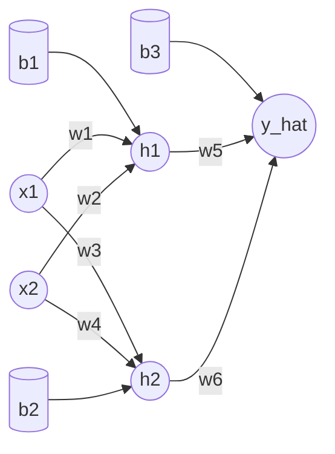

# xor-net

This is a mini-project where I implemented a neural network for XOR by hand in Rust.

It uses a network made up of 2 input neurons, 1 hidden layer with 2 neurons, and 1 output neuron, all with sigmoid activations and manual backpropagation:



- forward pass computes `z` and `a` values
- backward pass applies chain rule for all weights/biases
- gradient descent updates parameters each step

The goal here is understanding the mechanics of neural networks, not performance.

## Run

```bash
cargo run
```

The program trains on the 4 XOR samples and prints predictions after training.

## Notes

- Training can be sensitive to random initialization.
- Some runs converge to the correct XOR mapping, others can get stuck.
- If it fails to converge, try running it again!
